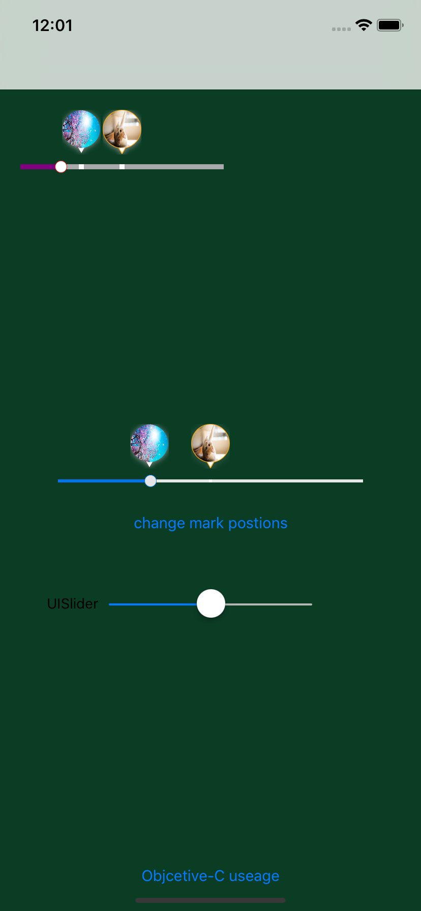

# GWMarkSlider

## Summary
GWMarkSlider is UISlider like, but you can add marks to indicate or show key infomations.

## Screenshot


## Use
This control is **IBDesignable** and uses the **target-action** pattern for change notifications.

In order to be notified when either thumb value changes and marks touch down, register for  `.EditingChanged`,`EditingDidEnd`,`.ValueChanged`:


```swift
markSlider = GWMarkSlider()
markSlider.frame = CGRect(x: 20, y: 50, width: 200, height: 25)
markSlider.trackHeight = 5
markSlider.minTintColor = UIColor.purpleColor()
markSlider.maxTintColor = UIColor.lightGrayColor()
markSlider.thumbTintColor = UIColor.redColor()
markSlider.markPositions = [0.1, 0.3, 0.4, 0.6, 0.9]
self.view.addSubview(markSlider)

markSlider.addTarget(self, action: #selector(self.markSliderEditingChanged(_:)), forControlEvents: .EditingChanged)
markSlider.addTarget(self, action: #selector(self.markSliderEditingDidEnd(_:)), forControlEvents: .EditingDidEnd)
markSlider.addTarget(self, action: #selector(self.markSliderSelecteValueChanged(_:)), forControlEvents: .ValueChanged)
```


## Thanks
Thanks to  [@warchimede](http://twitter.com/warchimede) ‘s [RangeSlider](https://github.com/warchimede/RangeSlider)

## Contact
Follow and contact me on [Twitter](https://twitter.com/gewill_org) or [Sina Weibo](http://weibo.com/gewei). If you find an issue, just open a ticket on it. Pull requests are warmly welcome as well.

## License
GWMarkSlider is available under the MIT License

